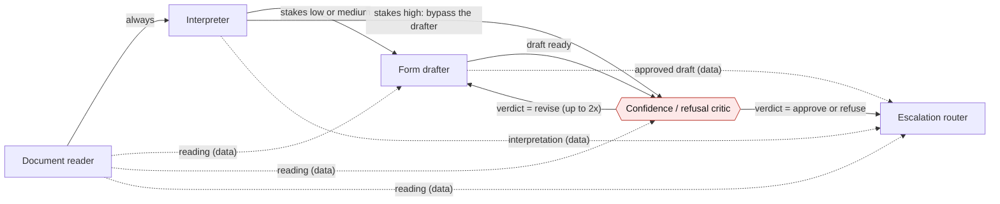

# Architecture

Front Desk is five Strands agents in a Strands Graph, one provider interface, and a thin front desk on top. The graph
execution-edge diagram can be regenerated with `poetry run household graph`; the code hooks below also affect the data that flows between nodes.

For a classified N4 corroborated by its English form heading, `reading_policy.py` constructs a source-checked canonical explanation before any downstream node sees it. The model's original reading remains in `SessionResult.model_reading`; `reading_policy` records the source and version. Explicitly labelled source fields supply the requested date and claimed amount; unsupported fields stay absent. The final N4 card uses the local policy's English/Spanish explanation and an unconfirmed staff handoff. This does not determine legal validity or replace bilingual review.

Public graph/agent hooks preserve typed predecessor outputs, the original document for drafting and review, and the previous draft on revision. The interpreter receives only the canonical reading; its separate back-translator still sees only the translated text. The policy hook is code around the reader result, not a sixth agent.

## The roster (a Strands Graph, not a pipeline with labels)



Solid edges decide who runs next; dashed edges decide what a node sees. Two things make this a graph rather than a
pipeline: on a high-stakes document the interpreter's output goes straight to the critic (the drafter never runs), and
the critic can send a draft back to the drafter with revision notes, bounded to two revisions.

Each agent is a `strands.Agent` with a Pydantic `structured_output_model`. The critic's judgement rests on two tools
that are ordinary code: `lookup_rule(document_class)` (the rule catalogue in `household/rules.py`) and
`score_fidelity(source_en, back_translation_en)` (`household/fidelity.py`). The interpreter's back-translation comes
from a `back_translate` tool that runs a fresh agent which never sees the English source. After the graph finishes, a
code policy guard re-derives the outcome from the catalogue and the fidelity band; if the model disagreed, the rule
wins and the disagreement is recorded.

## Deployment shape: production target and demo fallback

```mermaid
flowchart TB
    subgraph desk["Front desk (two people, one screen)"]
        staff["Staff view: English, back-translation, gauge, roster"]
        visitor["Visitor view: their language, large type, read aloud"]
    end
    ui["Web UI (FastAPI + SSE)"]
    cli["CLI: household run / trapset / graph"]
    subgraph runtime["Amazon Bedrock AgentCore Runtime (production target)"]
        entry["agentcore/app.py entrypoint"]
        graph["Strands Graph: reader · interpreter · drafter · critic · router"]
        entry --> graph
    end
    memory[("AgentCore Memory\n(opt-in per session)")]
    subgraph providers["One provider interface: household/providers"]
        bedrock["Bedrock (Claude / Nova)"]
        anthropic["Anthropic API"]
        openai["OpenAI API"]
        fake["Fake: fixture-backed, deterministic\n(tests + demo script)"]
    end
    speech["Speech: browser Web Speech API now;\nAmazon Polly + Transcribe behind the same interface"]
    staff --> ui
    visitor --> ui
    ui --> entry
    cli --> graph
    graph --> providers
    graph -. "AGENTCORE_MEMORY_ID set" .-> memory
    ui --> speech
```

`MODEL_PROVIDER` selects the model host and nothing else changes: the same agents, tools, schemas, graph and trap-set
run on `fake` (no network), `anthropic`, `openai`, or `bedrock`. The organizer confirmed a Strands build stays eligible
on any host; Bedrock via AgentCore Runtime is the production target and the path documented in
[`DEPLOY-AGENTCORE.md`](DEPLOY-AGENTCORE.md).

## What is stored

Nothing, by default. A session lives in process memory and is discarded when it ends; the printable summary is the
only artefact and it goes home with the visitor. AgentCore Memory is opt-in per deployment and is described on the
consent screen when enabled. Fixture documents in this repository are public government forms (extracted text) and
labelled synthetic letters; no real visitor documents exist anywhere in the project.

## Verification surfaces

- `poetry run pytest` — fidelity bands, rule citations, schema validation of every canned output, exact execution
  order of the three graph routes, streaming event order, the trap-set census, and the AgentCore Runtime HTTP contract
  in fake mode.
- `poetry run household trapset --provider <p> --write-readme` — the refusal set, both rates, regenerated into the
  README with the provider and date named.


Routine source contract: after the reader, matching ISO dates are restored only from source-quoted English dates. Form drafts render typed preparation_steps; an unchanged original-form excerpt accompanies the takeaway. After the critic, deterministic source/fact/payee/field-coverage checks can turn model approval into revision through the same feedback edge. model_reading, model_drafts and model_verdicts retain the raw outputs; the effective guard reports the override. This is not a sixth agent or a translation certification. Final English/Spanish routine cards contain fixed review/ownership wording with no staff commitment.
