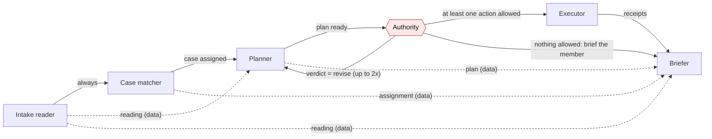

# Kith architecture

Kith is six Strands agents in a Strands Graph, one provider interface, a code-only authority ledger, and a thin household screen on top. The rule that makes it safe: **the model proposes, code decides, and code executes.** No model output ever becomes a decision or a side effect without being recomputed in code first.

The execution-edge diagram below is generated from the real graph with `household graph`; the dashed edges carry data between nodes without deciding who runs next.

## The roster (a Strands Graph, not a labelled pipeline)



- **Intake reader** — reads the photo, PDF, or typed request; quotes every amount and date; names the document. Nova Pro in the Bedrock preview.
- **Case matcher** — says who this is about and which skill applies, looking the household up.
- **Planner** — proposes actions from the matched skill's rules; never sends, pays, or files.
- **Authority** — checks every proposal against the ledger *in code*; can send the plan back to the planner (bounded to two revisions) or forward the allowed actions.
- **Executor** — runs only allowed actions through the rails and returns receipts.
- **Briefer** — tells the member what happened and what is waiting on whom, in their language.

Two things make this a graph, not a pipeline: the authority can loop back to the planner with revision notes (`verdict = revise`), and when nothing is allowed it skips the executor and briefs the member directly. Each node is a `strands.Agent` with a Pydantic `structured_output_model`; the roster is built in `household/agents/roster.py` and wired in `household/agents/graph.py`.

## The authority ledger

Every decision is made in code from a per-household ledger (`household/authority.py`, seeded from `fixtures/households/demo.json`). `authority.decide` is pure — same proposal, same ledger, same clock produces the same decision — and its rules run in a fixed order where the first decisive match wins (`RULE_UNKNOWN_MEMBER`, `RULE_FORGED_GRANT`, `RULE_RAIL_POLICY`, `RULE_MINOR_ALLOWANCE`, `RULE_MINOR_GUARDIAN`, `RULE_SELF`, `RULE_SELF_CONFIRM`, `RULE_PARENT_FOR_MINOR`, `RULE_GRANT`, `RULE_GRANT_REFUSED`, `RULE_NO_GRANT`, …). Every branch records a human-readable reason so the decision can be shown to the member, echoed by the model, and audited later.

The ledger has three record types:

- **Member** — role (`adult` / `minor`), guardians, language, and a salted PIN hash.
- **Grant** — a `grantor` delegates to a `grantee` the right to act on a `subject`, limited to a `scope` of action types, an amount `limit` and `limit_period`, and an `expires_at`, with a `status` and the `consent_id` that backs it.
- **Consent** — the signed record (`grant-accept`, with an HMAC `proof`) that a grant was accepted. A grant without an accepted consent authorizes nothing.

A separate `payment:transfer` invariant lives in code too: payments may only run on a household ledger rail (`BANK_RAILS = ("internal-ledger", "stripe-test")`), never on an arbitrary rail, so "pay" can never mean a real consumer bank transfer.

## The three enforcement points

The model is kept out of every consequential decision by three independent code checks (`household/pipeline.py` docstring):

1. **The authority tool result.** The plan is validated and registered in code — ids, the actor, and the idempotency key are never the model's. The decision the model sees is the tool result computed by `authority.decide`, not something it invents.
2. **The `AuthorityGuard` recompute.** When the authority node finishes, the guard re-runs `authority.decide_plan` over the whole plan. If the model's echo disagrees, the code decision replaces it and the disagreement is counted (`guard.overrides`); the UI reports the count.
3. **The tool-call veto hook.** `AuthorityHook` (`household/agents/hooks.py`) registers the same callback for the text agents' `BeforeToolCallEvent` and the voice agent's `BidiBeforeToolCallEvent`, so a spoken request can never reach a tool the typed path would refuse. It vetoes by cancelling the call (`cancel_tool`), keeping the model inside its allowlist, per-session call budget, and input guard. The hook is not the authority; `authority.decide` still judges every proposal.

Finally, receipts only exist if the executor issued them: a receipt the model writes itself is dropped and logged. The human approval gate is not a node — `pipeline.execute_approved` verifies a PIN, records consent, re-runs `authority.decide` with that approval, and executes, with no model involved.

## Executor rails and receipts

The executor's only entry point is `execute` (`household/executor/__init__.py`), which is idempotent and dispatches to one of five rails (`RAIL_FUNCTIONS`). A receipt's label is decided in code from the environment (`household/executor/receipts.py::label_for`), never by the model:

- `COMPLETE` — a real side effect happened; the provider's own reference is on the receipt.
- `PREPARE-ONLY` — an official form rendered for a human to review and file; never submitted.
- `SIMULATED-replay` — a recorded response replayed; the receipt says when it was fetched.
- `SIMULATED` — nothing left the machine; the receipt carries the sha256 of the exact request it would have sent.

The five rails are `ses-email`, `internal-ledger`, `stripe-test`, `official-form`, and `external-api-readonly`. The same proposal on the same day returns the receipt already issued rather than acting twice (`household/executor/idempotency.py`). The README "What is real" table is generated from this same `RAILS` metadata (`household/executor/readme.py`), so the docs cannot claim a capability the executor lacks.

## The approval flow

A minor's over-limit ask is the canonical needs-approval path: the graph stops at `needs-approval`, the guardian confirms out of band with a PIN, and only then does the executor act.

```mermaid
sequenceDiagram
    participant Kid as Kofi (minor)
    participant Graph as Six-agent graph
    participant Auth as authority.decide (code)
    participant Parent as Guardian (Ama/Daniel)
    participant Exec as Executor
    Kid->>Graph: "I need $40 from my allowance"
    Graph->>Auth: propose allowance:transfer 40 CAD
    Auth-->>Graph: needs-approval [minor-guardian] (over the $10 self-serve limit)
    Graph-->>Kid: "Asked your parents; nothing moves until they approve"
    Parent->>Exec: pick approver + PIN + Approve (execute_approved)
    Exec->>Auth: re-decide with approval + recorded consent
    Auth-->>Exec: allow
    Exec-->>Parent: COMPLETE receipt (internal-ledger, ref le-…)
```

## Vision, voice, web, and AgentCore paths

- **Vision** — the intake reader accepts a photo or PDF (`household run --image …`, or the web upload). In the Bedrock preview it is Nova Pro; live readings are in `docs/receipts/live-intake-2026-09-12.json` and the `live-photo-*` traces.
- **Voice** — Nova 2 Sonic over a `bidi` WebSocket (`household/voice/`, served at `/api/voice`). The voice agent shares the exact authority checks as text via the `BidiBeforeToolCallEvent` veto. A live turn is in `docs/receipts/voice-2026-09-12.json`.
- **Web** — a FastAPI app (`household/web/app.py`) where members identify with a PIN, read the who-may-decide ledger, ask in their own words, and approve queued actions. PIN hashes and salts and raw provider references are never sent to the browser. The shipped UI is an editorial "paper and ink" screen; a family-friendly mascot redesign is briefed (`docs/design/family-friendly-brief-2026-09-12.md`) but not yet built.
- **Channels** — a shared identity seam (`household/identity.py`) resolves a channel-native id to a member and binds new handles with HMAC-signed enrollment codes; a per-channel trust policy (`household/channels/policy.py`) governs where an approval may be collected (high-trust web/voice/cli vs low-trust telegram/sms/mcp). These are the foundation for chat/SMS/Alexa+ reach; no such adapter is wired into the pipeline yet.
- **AgentCore** — the same graph runs on Amazon Bedrock AgentCore Runtime via `agentcore/app.py` (streaming `/invocations` text path and `/ws` voice path). It is deployed as a non-root ARM64 image on the runtime `household_preview` under a scoped IAM role (no action wildcards) and verified with a live invocation — two household sessions returned results on real Bedrock. The runbook is in [`DEPLOY-AGENTCORE.md`](DEPLOY-AGENTCORE.md); the sanitized live and IAM receipts are [`receipts/agentcore-live-2026-09-12.json`](receipts/agentcore-live-2026-09-12.json) and [`receipts/agentcore-2026-09-12.json`](receipts/agentcore-2026-09-12.json).

## One provider interface

`MODEL_PROVIDER` selects the model host and nothing else changes: the same agents, tools, schemas, graph, and guardrail sweep run on `fake` (no network, deterministic; used by tests and the demo), `anthropic`, `openai`, or `bedrock` (`household/providers/`). Fake mode is what makes the guardrail scorecard and every test reproducible without a key.

## Verification surfaces

- `MODEL_PROVIDER=fake pytest` — authority rule coverage, executor label correctness, schema validation of every canned output, the exact execution order of the graph routes, the guardrail census, and the AgentCore HTTP contract in fake mode.
- `household guardrails --provider <p> --write-readme` — the two-rate scorecard (out-of-scope executed, false-refusal rate), regenerated into the README with the provider and date named.
- `household rails --write-readme` — the "What is real" table, regenerated from the executor's own rail metadata.
